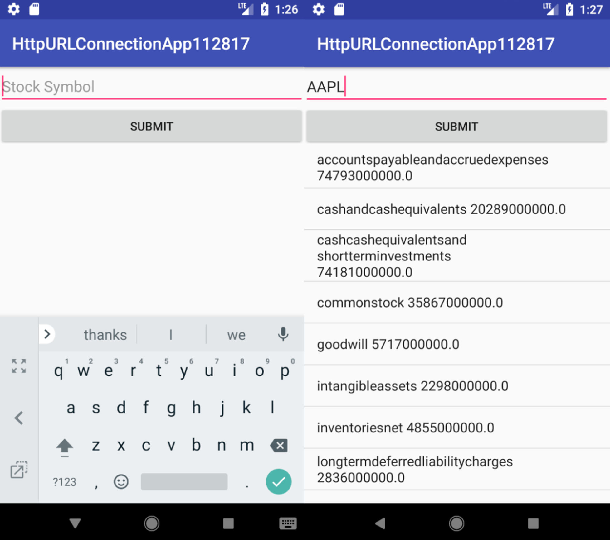
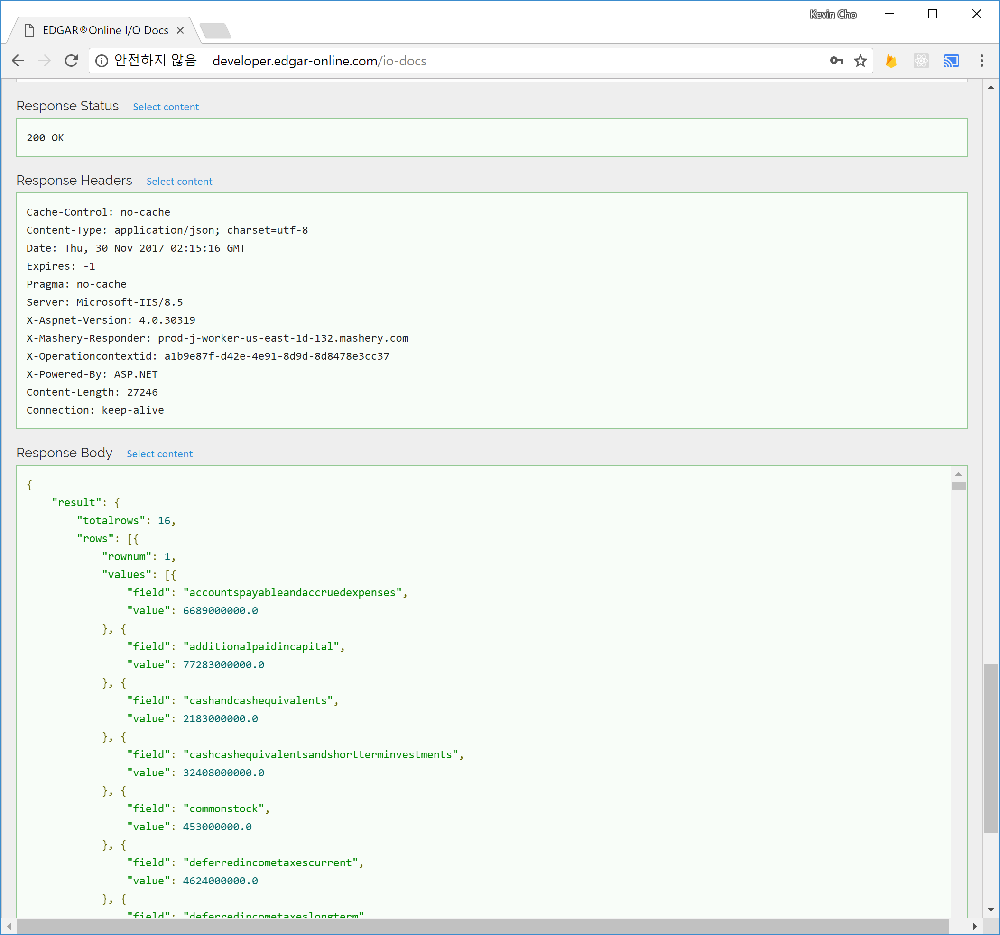

# HttpURLConnection-EdgarAPI

<h2>Description</h2>
Android Application uses HttpURLConnection with AsyncTask on MainActivity to parse JSON from Edgar API.
Financial Data are made available for viewing.

<h2>HttpURLConnection</h2>

HttpURLConnection establishes connection with API, and data on the web are accessible with Get method.   
  <code>urlConnection = (HttpURLConnection) url.openConnection();</code> 
   <code>urlConnection.setRequestMethod("GET");</code> 
    <code>urlConnection.connect();</code> 
  

  <h2>Edgar API</h2>
  
Edgar API&trade; provides outlet for company financial data for educational, non commercial use. HttpURLConnection activity ought to be conducted in non-main thread, for it shall cause NetworkException. 

  <h2>AsyncTask, doInBackground(), onPostExecute()</h2>
  
AsyncTask methods are comprised of doInBackground() and onPostExecute(). URLConnection is established with <code>.setRequestMethod("GET")</code>. This program is configured to process Json output from "v2-Core Financials YTD".  Upon Connection, InputStreamReader, StringBuffer process data and output as String.

  

  
Processed jsonStr is parsed as Json. Return values resulting from actions through doInBackground() gets passed to onPostExecute().

  
  <h2>jsonParser</h2>
  
jsonParser constructs Json object from String. JsonObjects, JsonArrays, JsonElements comprise json tree.

  <code>JsonParser parser = new JsonParser();</code> 
  <code>JsonObject o = parser.parse(jsonStr).getAsJsonObjet();</code> 
  <code>JsonObject result = o.getAsJsonObject("result");</code> 
  <code>JsonArray rows = result.getAsJsonArray("rows");</code> 
